# 🤖 AI Research Agent

An intelligent multi-agent research assistant that takes any topic, searches the web and your own documents, writes a structured report, and self-reviews it — all automatically. Built with LangGraph, Groq LLM, Qdrant vector database, and Streamlit.

---

## 📌 What It Does

You type a research topic. The agent takes care of the rest — it searches the web, scrapes relevant pages, looks through your uploaded documents, writes a full report, and then critiques its own output. You can give feedback and it will revise until you're satisfied.

---

## 🧠 Agent Architecture

The agent is built as a **LangGraph state graph** with 4 specialized nodes defined in `lg/`:

<div align="center">
  
</div>

The graph definition lives in `lg/graph.py` and the shared agent state is managed in `lg/state.py`.

---

## 🛠️ Tools

| Tool | File | What It Does |
|---|---|---|
| 🌐 `web_search` | `tools/web_search.py` | Searches the web via DuckDuckGo |
| 🔗 `scrape_url` | `tools/scraper.py` | Scrapes and extracts content from URLs using BeautifulSoup / Selenium |
| 📚 `search_knowledge_base` | `tools/search_kb.py` | Searches your uploaded documents using Qdrant vector similarity (RAG) |

---

## 📂 Supported Document Formats

Upload any of these and the agent will index and search them:

`PDF` · `DOCX` · `TXT` · `CSV` · `XLSX` · `JSON`

Documents are ingested via `ingestion/pipeline.py`, chunked, embedded with Sentence Transformers, and stored in Qdrant (`vector_db/qdrant_store.py`). Retrieval is handled by `vector_db/qdrant_search.py`.

---

## ✨ Key Features

- **Multi-agent pipeline** — Planner, Tool Executor, Writer, and Critic, each with a clear role
- **RAG (Retrieval-Augmented Generation)** — Upload your own documents and the agent uses them
- **Live web search** — Always pulls fresh, up-to-date information
- **Self-review loop** — The Critic scores the report and triggers revision automatically if needed
- **Human-in-the-loop feedback** — Give feedback after the Critic and the agent revises accordingly
- **Two interfaces** — Chat UI via Streamlit (`app.py`) or terminal CLI (`main.py`)
- **Session stats** — Track tools called and document chunks loaded in real time

---

## 📁 Project Structure

```
research_agent/
├── app.py                        # Streamlit chat UI with streaming
├── main.py                       # CLI interface
├── requirements.txt
├── graph.svg                     # Visual diagram of the agent graph
├── data/                         # Drop documents here for CLI ingestion
│
├── ingestion/
│   └── pipeline.py               # Document loading, chunking & embedding
│
├── lg/
│   ├── graph.py                  # LangGraph graph definition (nodes + edges)
│   ├── nodes.py                  # LLM, Writer, Critic node logic
│   └── state.py                  # Shared agent state schema
│
├── llm/
│   └── groq_client.py            # Groq LLM client setup
│
├── tools/
│   ├── web_search.py             # DuckDuckGo web search tool
│   ├── scraper.py                # URL scraping tool
│   └── search_kb.py              # Knowledge base (RAG) search tool
│
├── utils/
│   └── data_loader.py            # Shared file loading utilities
│
└── vector_db/
    ├── qdrant_store.py           # Store embeddings in Qdrant
    └── qdrant_search.py          # Similarity search in Qdrant
```

---

## 🛠️ Tech Stack

| Category | Library / Tool |
|---|---|
| Agent Framework | LangGraph, LangChain |
| LLM | Groq (`langchain-groq`) |
| Vector Database | Qdrant (`qdrant-client`) |
| Embeddings | Sentence Transformers (`langchain-huggingface`) |
| Web Search | DuckDuckGo Search (`ddgs`) |
| Web Scraping | BeautifulSoup4, Selenium, lxml |
| Document Parsing | PyPDF, docx2txt, openpyxl, pandas |
| UI | Streamlit |
| Config | python-dotenv |

---

## ⚙️ Setup & Installation

### 1. Clone the Repository

```bash
git clone https://github.com/JenilGoti/research_agent.git
cd research_agent
```

### 2. Install Dependencies

```bash
pip install -r requirements.txt
```

### 3. Configure Environment Variables

Create a `.env` file in the root folder:

```env
GROQ_API_KEY=your_groq_api_key_here
```

Get your free Groq API key at [console.groq.com](https://console.groq.com)

---

## 🚀 Running the App

### Option A — Streamlit UI (recommended)

```bash
streamlit run app.py
```

Opens at `http://localhost:8501`

### Option B — Terminal CLI

```bash
python main.py
```

Place any documents you want ingested inside the `data/` folder before running.

---

## 💬 How to Use (Streamlit)

1. Upload documents using the file uploader *(optional)*
2. Type your research topic in the chat
3. The agent searches, scrapes, writes, and reviews automatically
4. Give feedback to revise, or click **Done** when you're happy with the report

---

## 💡 Example Queries

```
"What are the latest trends in large language models?"
"Summarize the key findings from my uploaded PDF"
"Compare transformer vs Mamba architectures for sequence modelling"
"Give me a research report on renewable energy in Germany"
```

---

## 🔮 Future Improvements

- Export final report to PDF or DOCX
- Add source citations with URLs in the report
- Support persistent multi-session memory
- Add support for more LLM providers (OpenAI, Anthropic)

---

## 🙏 Acknowledgements

- [LangGraph](https://github.com/langchain-ai/langgraph) — agent graph framework
- [Groq](https://groq.com/) — ultra-fast LLM inference
- [Qdrant](https://qdrant.tech/) — vector database
- [Streamlit](https://streamlit.io/) — UI framework